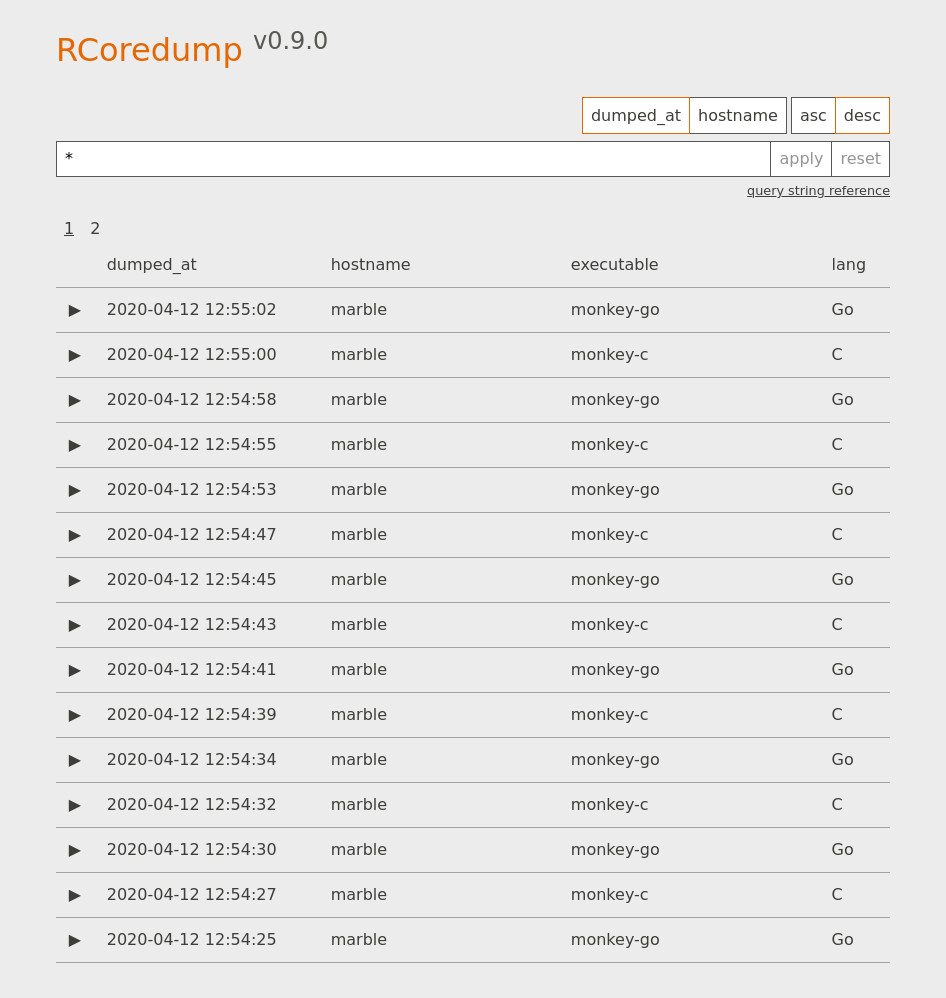

# rcoredump

_rcoredump_ is meant to be a toolbox for aggregating, indexing, and searching
core dumps. Think ELK for core dumps.



_rcoredump_ is composed of two main softwares:

- `rcoredumpd` is the indexer. It store, analyze, and index the core
  dumps and the associated binaries, and must be installed on the destination
  server.
- `rcoredump` is the forwarder. It collect core dumps and the associated
  binaries, and must be installed on the source servers.


## Status: Alpha

THe project is in its infancy stage. While it can be used already for some
usages, many things may change between now and the v1, and no feature is
guaranteed to stay the same or even be present in future releases. Of course,
we will try to stay compatible as much as possible, but if we can't, you've
been warned.

## Installation

### From releases

The simplest way to install _rcoredump_ is to use the repository's [release
page](https://github.com/elwinar/rcoredump/releases). The binaries are
currently built for Linux only, in 32 and 64 bits architectures. New systems
and architectures can be added as long as they are supported by Golang. Feel
free to open an issue if you would like to see binaries for your platform.

*Note* The current list can be listed using the command `go tool dist list`
with any go installation.

### From source

Installing from source require only a working Golang installation. Your system
probably provides a Golang package, you can also read the [Getting
Started](https://golang.org/doc/install) page on Golang's website. It is
recommended to use the very last version of Golang, but any module-enabled
version should do.

Then, you can either run the following commands to get it using golang's
package manager:

	go get github.com/elwinar/rcoredump/bin/rcoredumpd
	go get github.com/elwinar/rcoredump/bin/rcoredump

Or clone the repository and build it by hand:

	git clone https://github.com/elwinar/rcoredump
	cd rcoredump
	go build ./bin/rcoredumpd
	go build ./bin/rcoredump

## Configuration

Both binaries can be configured using either the CLI or a configuration file
with an ini-like syntax. Both usage message can be printed on screen using the
`-help` flag.

*Note* The flag syntax follow the Golang's standard package convention,
described [here](https://golang.org/pkg/flag/#hdr-Command_line_flag_syntax).

### `rcoredumpd`

```
Usage of rcoredumpd: rcoredumpd [options]
  -bind string
        address to listen to (default "localhost:1105")
  -bleve.path string
        path of the directory to store the coredumps into (default "/var/lib/rcoredumpd/index")
  -c.analyzer string
        command to run to analyze C core dumps (default "gdb --nx --ex bt --batch {{ .Executable }} {{ .Core }}")
  -conf string
        configuration file to load (default "/etc/rcoredump/rcoredumpd.conf")
  -dir string
        path of the directory to store data into (default "/var/lib/rcoredumpd")
  -go.analyzer string
        command to run to analyze Go core dumps (default "dlv core {{ .Executable }} {{ .Core }} --init {{ .Dir }}/delve.cmd")
  -index-type string
        type of index to use (values: bleve) (default "bleve")
  -version
        print the version of rcoredumpd
```

### `rcoredump`

```
Usage of rcoredump: rcoredump [options] <executable path> <timestamp of dump>
  -conf string
        configuration file to load (default "/etc/rcoredump/rcoredump.conf")
  -dest string
        address of the destination host (default "http://localhost:1105")
  -filelog string
        path of the file to log into ('-' for stdout) (default "-")
  -src string
        path of the coredump to send to the host ('-' for stdin) (default "-")
  -syslog
        output logs to syslog
  -version
        print the version of rcoredump
```

By default, the forwarder expect the core dump to be passed on the standard
input. You can use sysctl's `kernel.core_pattern` tunable (on linux) to have
the kernel invoke _rcoredump_ everytime a dump is generated. For example:
`kernel.core_pattern=|/path/to/rcoredump %E %t`.

*Note* No space between the `|` and the binary's path. Also, no environment
variable, so no `PATH`, you must use an absolute path here.

The forwarder can also be invoked by hand using the `-src` flag and a file
path. This is mostly used for development and to test an installation.

### Logging

All logging is done on stdout using the _logfmt_ format. This output can be
redirected easily enough using various utilities, like `logger` for syslog. For
convenience, the forwarder also accept a `-syslog` flag to log using syslog, and
a `-filelog` flag to log to a file.

### Storage

Right now, the indexer stores every core dump and binary on disk. As both of
them can be quite large, it is recommended to closely monitor the size of the
data directory (set  by the server's `-dir` flag), and the free space on the
disk.

## Need Help?

Feel free to open an issue, or contact me by mail at
`romain.baugue@elwinar.com`. I won't guarantee and instant solution, but I'm
always happy to help someone ge things working.

## Contributing

The project is open to contribution, but no guidelines or requirements are set
for now, as this is mostly a one-man project. Feel free to contact me if you
want to help, and we will define this part together.

## License

[The Unlicence](./LICENSE)
